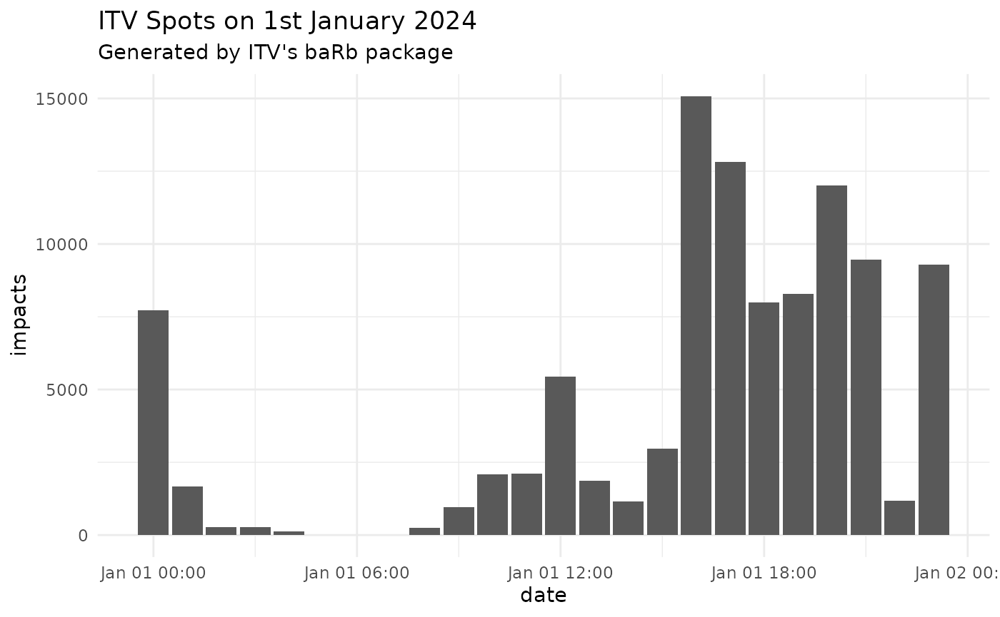

# daily-impacts-chart

``` r

library(baRb)
library(ggplot2)

# Demo data loaded from package to avoid needing credentials
# spots <- barb_get_spots('2024-01-01',
#                         '2024-01-01',
#                         advertiser_name = 'ITV',
#                         async = FALSE)

spots <- spots_demo

head(spots)
#> # A tibble: 6 × 74
#>   document_id panel_region is_macro_region station_name sales_house_name
#>         <int> <chr>        <lgl>           <chr>        <chr>           
#> 1           6 Wales        FALSE           ITV1+1       ITV SALES       
#> 2           8 North West   FALSE           ITV1 HD      ITV SALES       
#> 3          19 Border       FALSE           ITV1+1       ITV SALES       
#> 4          30 North East   FALSE           ITV1+1       ITV SALES       
#> 5          39 North East   FALSE           ITV1         ITV SALES       
#> 6          54 North West   FALSE           ITV1+1       ITV SALES       
#> # ℹ 69 more variables: clearcast_commercial_title <chr>,
#> #   preceding_programme_name <chr>, spot_duration <int>, break_type <chr>,
#> #   commercial_number <chr>, advertiser_name <chr>, product_name <chr>,
#> #   clearcast_web_address <chr>, standard_datetime <chr>, all_homes <dbl>,
#> #   all_adults <dbl>, all_men <dbl>, all_houseperson <dbl>,
#> #   all_children_aged_4_15 <dbl>, adults_16_24 <dbl>, adults_16_34 <dbl>,
#> #   adults_35_44 <dbl>, adults_45_54 <dbl>, adults_55_64 <dbl>, …

spots_summary <- barb_rollup_spots(spots, granularity = "hour")

head(spots_summary)
#> # A tibble: 6 × 11
#>   parent_station_name sales_house_name clearcast_commercial_title
#>   <chr>               <chr>            <chr>                     
#> 1 ITV1                ITV SALES        BRISTOL                   
#> 2 ITV1                ITV SALES        GENERIC                   
#> 3 ITV1                ITV SALES        GENERIC                   
#> 4 ITV1                ITV SALES        GENERIC                   
#> 5 ITV1                ITV SALES        GENERIC                   
#> 6 ITV1                ITV SALES        GENERIC                   
#> # ℹ 8 more variables: preceding_programme_name <chr>, spot_duration <dbl>,
#> #   commercial_number <chr>, advertiser_name <chr>, product_name <chr>,
#> #   clearcast_web_address <chr>, date <dttm>, impacts <dbl>

spots_summary |> 
  ggplot(aes(x = date, y = impacts)) +
  geom_col() +
  labs(title = "ITV Spots on 1st January 2024", subtitle = "Generated by ITV's baRb package") +
  theme_minimal()
```


